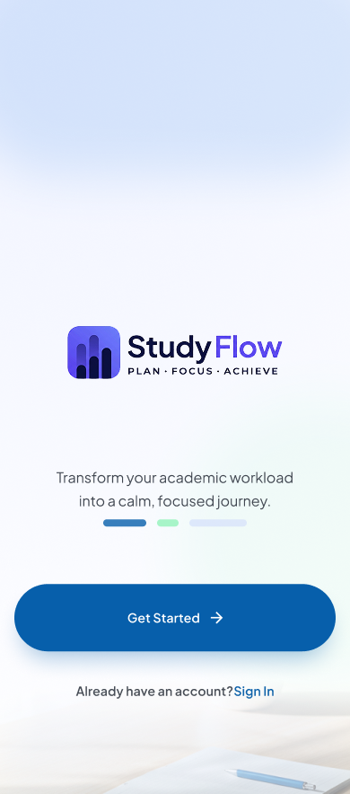
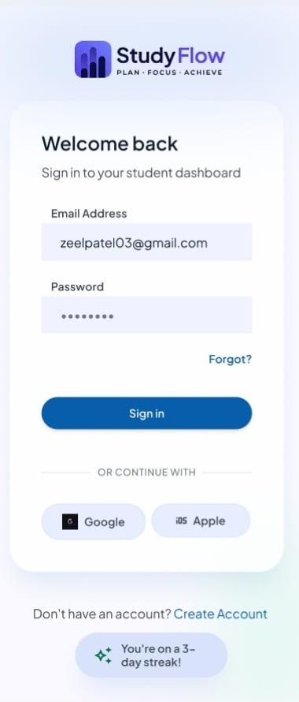
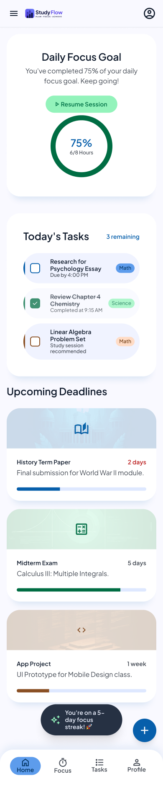
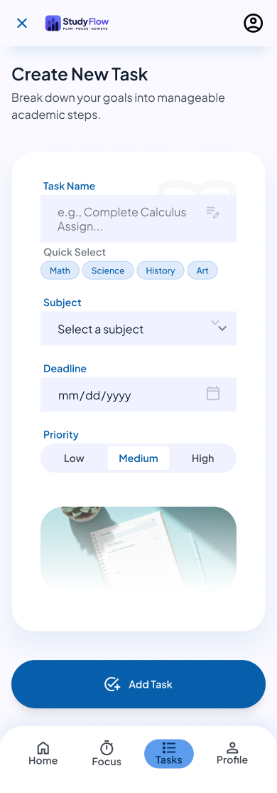
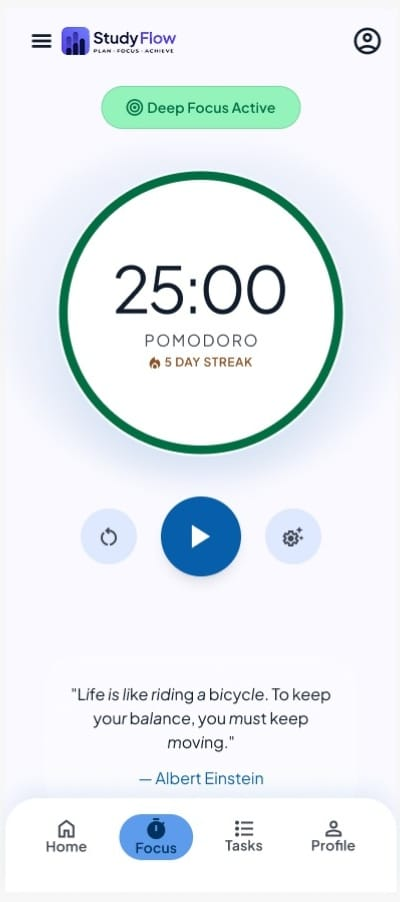
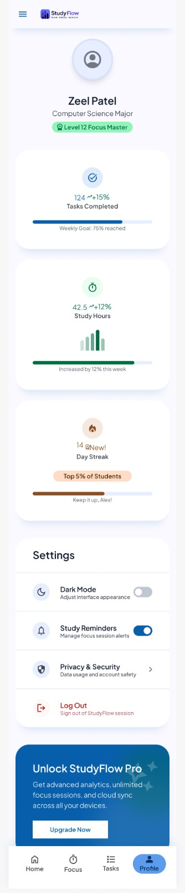

# 📚 StudyFlow

### A Modern Student Productivity Mobile App UI/UX Design

Designed in **Figma** to help students organize tasks, manage study schedules, stay focused, and improve productivity.

🎨 **UI Design** • ✨ **UX Design** • 📱 **Mobile App** • 🖌️ **Figma**

---

# 📖 Overview

StudyFlow is a mobile application designed to simplify students' daily study routine. It provides a clean and intuitive interface where users can manage tasks, stay focused, and track their progress efficiently.

The project focuses on creating a seamless user experience with modern UI principles, consistent visual design, and user-centered interactions.

---

# 🎯 Problem Statement

Students often struggle with organizing study schedules, managing daily tasks, and maintaining focus during study sessions.

---

# 💡 Solution

StudyFlow provides an intuitive platform where students can:

- Organize study tasks
- Stay focused using Focus Mode
- Track daily productivity
- Manage their profile
- Reset passwords securely
- Experience a clean and distraction-free interface

---

# ✨ Features

- 📋 Task Management
- 🎯 Focus Mode
- 📊 Dashboard
- 🔐 Login Screen
- 🔄 Reset Password
- 👤 User Profile
- 🎨 Modern UI
- 📱 Mobile-First Design

---

# 🛠 Tools Used

- Figma
- UI Design
- UX Design
- Wireframing
- Prototyping

---

# 📱 App Screens

## Cover

---

## Login

---

## Dashboard

---

## Task Management

---

## Focus Mode

---

## Reset Password

---

## Profile

---

# 🎨 Interactive Prototype

- 🔗 [Figma Prototype](https://www.figma.com/proto/O8DC2NyMhUiK1uAP41xwrK/study-flow?page-id=0%3A1&node-id=3-2&viewport=83%2C100%2C0.25&t=mBQmMljlRnZC1OF7-1&scaling=scale-down&content-scaling=fixed&starting-point-node-id=3%3A2)
- 🔗 [Case Study Presentation](https://docs.google.com/presentation/d/1QBilkCGGl8JzIEojPYzKgXCQwfOTgnKm/edit?usp=sharing&ouid=113219155399318941852&rtpof=true&sd=true)
- 🔗 [Live Portfolio](https://zeelspatel-design.netlify.app)

---

# 🚀 Future Improvements

- 🌙 Dark Mode
- 🔔 Push Notifications
- 📈 Study Analytics
- 📅 Calendar Integration
- 💻 Responsive Web Version

---

# 👩‍💻 Designer

**Zeel Patel**

UI/UX Designer

---

⭐ If you like this project, consider giving it a ⭐ on GitHub!

